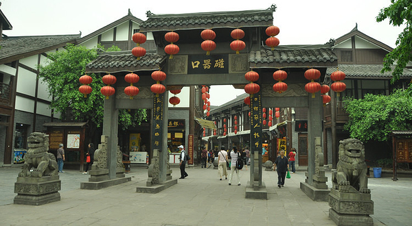
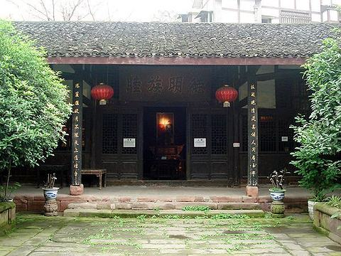
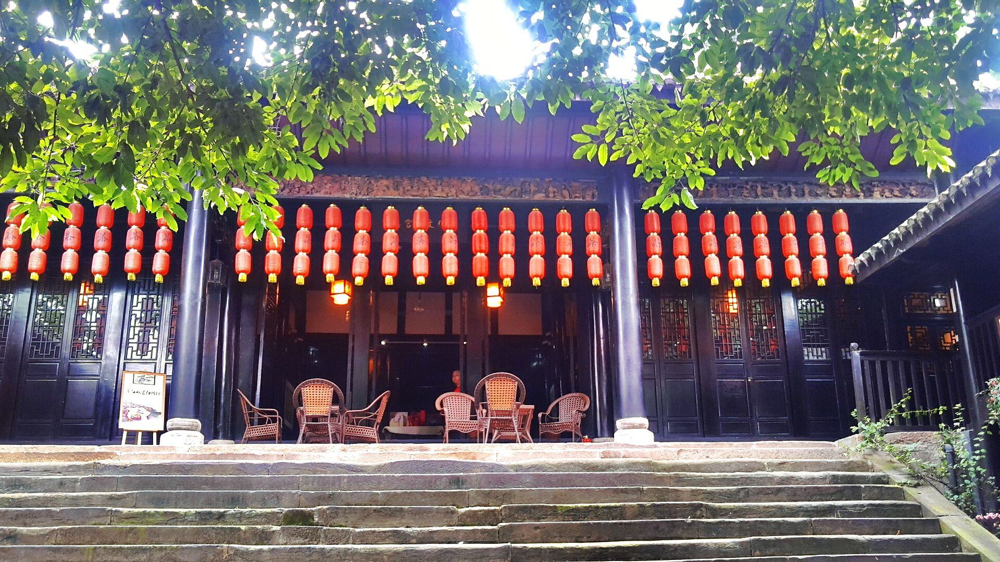
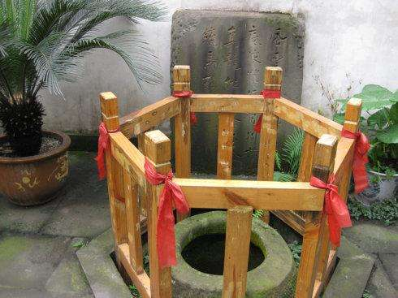
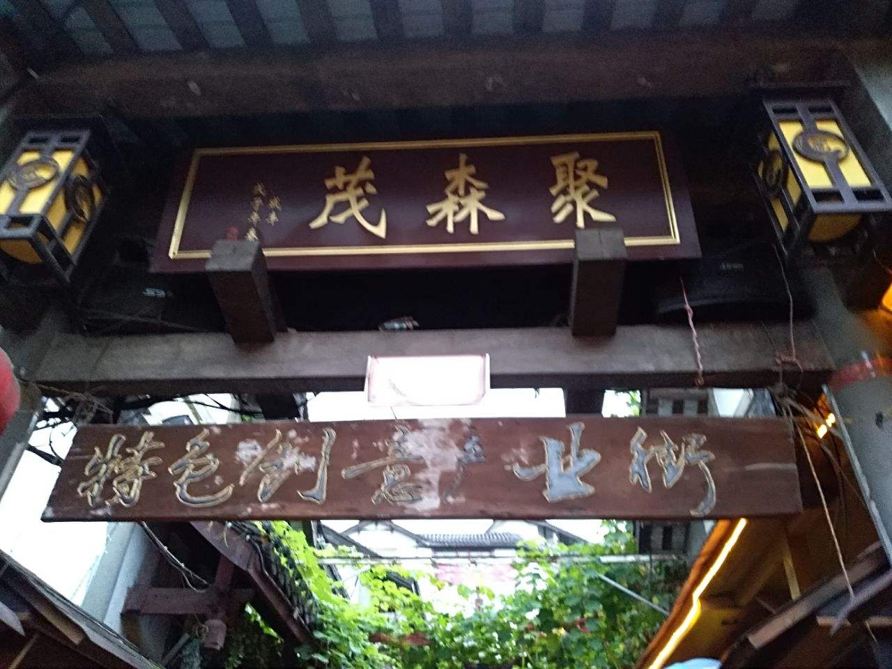
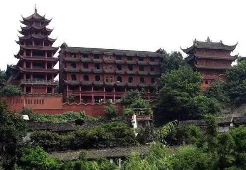
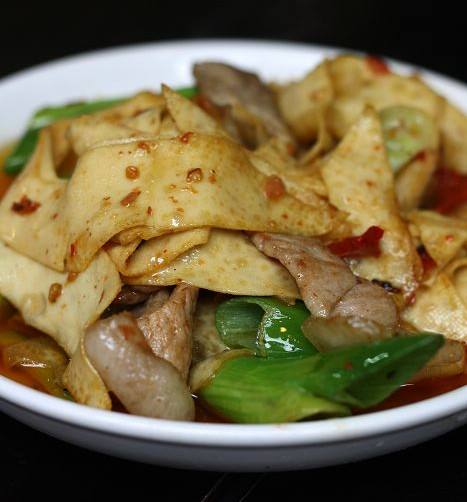
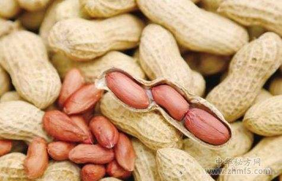

# 磁器口

古镇位于重庆市沙坪坝区嘉陵江畔，始建于宋代，面积1.5平方公里，东临嘉陵江，南接沙坪坝，西界童家桥，北靠石井坡，距主城区3公里，是历经千年变迁而保存至今的重庆市重点保护传统街。即使是重庆本地人，也一生必去一次的地方。因为磁器口和其他景点不同，磁器口凝聚了重庆千年来的独特文化。吊脚楼、青石板、码头、陈麻花等等，仿佛没有走过这一条古街，都不能称呼自己为重庆人。外地人了解重庆体验历史最便捷的通道，就是磁器口古镇的大街。

## 路线推荐:

- [钟家大院](#钟家大院)(门票5元) --> [翰林院](#翰林院) --> [宝善宫](#宝善宫) --> [深水井](#深水井) --> [聚森茂](#聚森茂) --> [宝轮寺](#宝轮寺)(门票5元) --> [巴渝民居馆沿途](#巴渝民居馆沿途) --> [文昌宫古宅门](#文昌宫古宅门)

## 磁器口三宝：
 - [毛血旺](#毛血旺) 、[千张皮](#千张皮) 、[椒盐花生](#椒盐花生)

#### **钟家大院**

感受南北建筑风格，欣赏明清两朝雕花古床迥异风格，体验清末大户人家民俗。

#### **翰林院**

翰林院出过磁器口官员中最高职务者，黄钟音。现在是书画一条街，入住了不少美术界人士。可以赏画、买画。

#### **宝善宫**

先到宝善宫对面的邓和平剪纸欣赏民间手艺。邓和平的剪纸有"不描不画凭手而剪"的特点，作品远销海内外，其最拿手的为刺绣剪纸。宝善宫内可参观陶瓷博物馆，还可以参观丁肇中纪念室。

#### **深水井**

相传建文帝曾在深水井中避难。参观深水井，另外可以在茶楼喝茶、看风景。

#### **聚森茂**

聚森茂是今年5月才开业的新街。聚森茂原是酱园的名字，现在成为古镇中相对时尚的一条街。

#### **宝轮寺**

参观当年建文帝隐居的地方，烧香拜佛许愿。另外一直往前走可见到特色小水吧。

巴渝民居馆沿途

注解：巴渝民居馆暂时闭门修整，但并不影响游客游玩。在去往巴渝民居馆的沿途是最避开喧嚣，最能感受磁器口古镇生活的一条路，有青蔓、吊脚楼、古镇人家、小猫小狗，一派生活气息十足的场景。

文昌宫古宅门

再往上走到文昌宫古宅门，可登高望江，以及宝轮寺全景。

周边景点

磁器口周边有红岩魂广场，烈士群雕(歌乐山烈士陵园)，白公馆，渣滓洞监狱旧址，歌乐山森林公园等景点，除歌乐山森林公园门票需要10元以外，其它景点现均免费开放。

从磁器口大门坐任意车到烈士墓，在烈士墓转面包车(专到歌乐山森林公园，途经红岩魂广场、白公馆、渣滓洞、歌乐山索道)。有时间，天气好，也可选择徒步上山。途中有叉路，可询问路人。

纪念品

手工面人，刺绣，古镇草编，木雕，陶瓷，画扇，特色签名画。

#### *毛血旺*

食材：以鸭血为主料，加入毛肚、鳝鱼、豆芽等配料烹制的一道渝菜，具有麻辣鲜嫩烫、色泽红亮、香气浓郁的特点。

      毛血旺乃磁器口名特三绝之一。民间有言子: **到磁器口不吃毛血旺，等于没到磁器口** 。重庆毛血旺起源于重庆嘉陵江畔的磁器口，是重庆市的传统名菜，属于重庆菜。具有麻、辣、烫、鲜、香的特点。麻辣鲜香，汁浓味足，开胃除湿。毛血旺烹饪手法粗犷豪迈，但又暗合烹饪至理，毛血旺开创了一种新烹饪手法，是重庆渝菜江湖菜的鼻祖之一，近年来，红遍大江南北。血有补血和清热解毒作用，并有预防和缓解缺铁性贫血的效果。

#### *千张皮*

      磁器口千张传承久远，传承有序，经浸泡、磨浆、煮浆、滤浆、点浆等9个步骤28道工序。口感细腻绵软，柔韧不碎，按味道分有麻辣、香辣、五香、椒香、泡椒、烧烤、怪味等味道，按特性分有软千张、糯千张、手撕千张、八宝千张、包馅千张等形式，其形薄如纸张，质地细腻，融入了独特的巴渝地区的文化特征，是重庆地区传统名小吃之一，于2012年入选第二批区级非物质文化遗产项目名录。

#### *椒盐花生*

原料: "三连籽”是一种生长期达7个月的冬花生，产于歌乐山阴山油沙地，亩产不过50公斤，过去专供磁器口椒盐花生制作。“三连籽”地下蔓藤最长可达五六米，收获时主要靠人一颗一颗在地里翻土寻找，十分困难。由于生长期长，产量低，收获困难等原因，人们都不愿种植。

