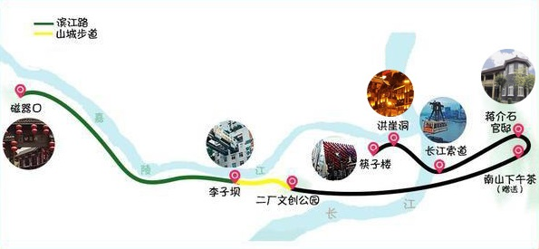

**重庆 是座很神奇的城市，总以为在几十楼的你,其实在地面。重庆是一座3D城市，请不要用平原城市的思维跟着地图在重庆找路，你眼前看不到的路，可能只是一个梯坎下坡了，所以使用2D导航的你需要做好规划啦 ...**

### 1. 推荐路线及景点：

    Day1：解放碑—长江索道—洪崖洞—南滨路

    第一天旅游路线：  磁器口->渣滓洞->白公馆->重庆解放碑->长江索道->朝天门广场->洪崖洞->南滨路

    Day2：磁器口->四川美术学院

    Day3：李子坝->鹅岭二厂->南山一棵树

### 1. 参考路线一：
 

### 2. 时间安排：
**6-8月份不建议去重庆玩，热得连本地人都不想出门，其余时间还好**

     9:00   磁器口
    10:30   李子坝
    11:00   二厂文创公园
    14:00   南山下午茶 蒋介石官邸
    16:30   长江索道
    17:30   洪崖洞 解放碑 筷子楼
    ...     火锅开吃

如上图所示，首先去游玩[磁器口](./磁器口/磁器口.md)，然后沿着嘉陵江的滨江路游玩李子坝，接着由体验著名的“山城步道”至二厂文创公园，下午到南山风景区区喝下午茶，再游玩蒋介石官邸、长江索道、洪崖洞、筷子楼（国泰艺术中心）

住宿：建议住在解放碑商圈内，洪崖洞、八一好吃街、国泰艺术中心（筷子楼）、长江索道等景点都位于解放碑。并且，解放碑夜景好，从逛街、游玩、观景、美食等综合考究，解放碑都是重庆旅游的最佳住宿点之一。

线路优点：重庆不仅是网红城市，更是长江、嘉陵江两江交汇地，江景很漂亮。该线路沿着滨江路走，除了可以游玩市区热门景点外，还可以体验重庆的“滨江路”、“特色山城马路”，感受山城盘山江景路的地道乘坐体验。

游玩景点：磁器口+李子坝+二厂+南山下午茶+蒋介石官邸+长江索道+洪崖洞+筷子楼，具体游玩时间如下图所示：

1、磁器口：即使是重庆本地人，也一生必去一次的地方。因为磁器口和其他景点不同，磁器口凝聚了重庆千年来的独特文化。吊脚楼、青石板、码头、陈麻花等等，仿佛没有走过这一条古街，都不能称呼自己为重庆人。外地人了解重庆体验历史最便捷的通道，就是磁器口古镇的大街。

2、李子坝：被誉为“空中飞毯”的李子坝轻轨穿楼景区，位于轻轨2号线的李子坝站，每隔3~5分钟都会上演轻轨穿楼越壑、空中飞驰的神奇一幕。这巧夺天工横穿居民楼的景象，成为国内外游客心中无比稀奇的一幕，更能拍摄“口吞轻轨”等趣味创意视频。

3、鹅岭二厂文创公园：作为复古文创街区的鹅岭二厂，不仅见证了重庆百年的沧海桑田与变迁，更刻下了建国起来峥嵘岁月的印记。古典艺术与创造力的发酵，老与新的糅合，令一个老厂区的街头巷尾无不被中外艺人的文化气息所笼罩。半悬在楼顶的跑车车头，穿越房屋而生长的千年古树，古朴幽静的创意廊道，《从你的全世界路过》取景地……走在文创二厂的旧街上，一步一格调，让想象力迈出思维的牢笼。

4、南山下午茶：为了避免行程劳累，特意在做攻略时为大家安排了下午茶体验。恬静午后，停下匆匆脚步，一边品一壶夏日清凉老茶，一边透过落地玻璃窗遥望南山风景区，一边盘一份精美瓜果小吃。躲在时光长廊里，适当地融入巴蜀当地的慢生活，感受余生充实的一份美好与确幸。

5、蒋介石官邸：黄山蒋介石官邸位于南山风景区，处于奇峰幽谷之间，遍山松柏簇拥，风景幽美，属南山风景区范围。1938年，日本对重庆实施战略轰炸，为躲避日机轰炸，蒋介石侍从选中黄山，为蒋、宋修建官邸。蒋介石住“云岫”楼，宋美龄住“松厅”。“云岫”与“松厅”之间的凹谷小道旁挖有防空洞，专为蒋、宋避日机突袭时用。

6、长江索道：【避开长江索道排队高峰】“排队2小时，乘坐5分钟”，这是游客对长江索道的普遍说辞。和普通长江索道排队不同，我们是从长江南岸体验长江索道，减少了排队时间，平时游客几乎不用排队即可体验重庆的“空中公交”。游客自由行体验长江索道，司机师傅在索道对面等候接车。

最后，大家继续参观洪崖洞、解放碑八一好吃街、国泰艺术中心。先去八一好吃街吃东西，等天色黑去后到洪崖洞、国泰艺术中心看夜景。此3地相隔不远，步行10余分钟即可互通。

重庆旅游攻略，大家不清楚的都可以私信问我哦，小编保证有问必答！重庆人民热情好客，慷慨大方，外地人来旅游，没有本地人的导航会迷路的哦，欢迎大家来重庆玩，更欢迎大家不清楚的私信问我！